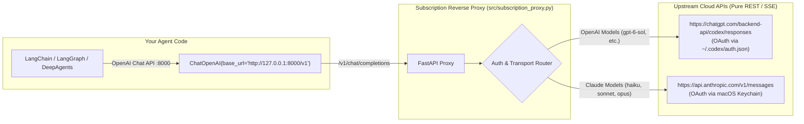

# Graph Engineering Lab

Experiments with Agentic Workflows, Knowledge Graphs, and Local LLM Tooling.

---

## 🌐 Subscription Reverse Proxy (`subscription_proxy.py`)

A reverse-authenticated proxy for **OpenAI** and **Anthropic** that lets you run **LangChain**, **LangGraph**, and **DeepAgents** directly against frontier models using your active **Claude Pro** and **ChatGPT Plus/Pro Codex** subscriptions — without paying for separate API credits and with **zero proxy-side model inference**.

### 🏗️ Architecture



### Key Differences from CLI Subprocesses & MITM Gateways:
- **No Proxy-Side Model Inference**: The proxy does zero inference, runs no local LLMs, and injects no decision models. It is strictly an authentication and protocol translation layer.
- **No Subprocess Harness**: Does not execute `claude -p` or `codex exec`, eliminating CLI startup latency, git worktree checks, hooks, terminal formatting, and agent persona injection.
- **True Real-Time Streaming**: Directly pipes Server-Sent Events (SSE) from the upstream cloud APIs to your client.
- **Native Tool Calling**: Automatically translates standard OpenAI `tools` and `tool_calls` schemas to Anthropic and Codex native formats.

---

## 🚀 Setup & Quickstart

### 1. Requirements

```bash
source .venv/bin/activate
pip install -r requirements.txt
```

### 2. Start the Proxy Server

```bash
# Starts proxy on http://127.0.0.1:8000 (default backend: codex)
python src/subscription_proxy.py --port 8000

# Or with Claude as default:
python src/subscription_proxy.py --port 8000 --backend claude
```

### Endpoints:
- `GET /health`: Health status & active subscription authentication detection.
- `GET /v1/models`: List of models available through your subscriptions.
- `POST /v1/chat/completions`: Standard OpenAI Chat Completions endpoint (streaming & non-streaming).
- `POST /v1/responses`: OpenAI Responses API endpoint.

---

## 🤖 3. Running the LangChain ReAct Agent

```bash
# Query using Claude (Anthropic subscription)
python src/react_agent.py --model claude --query "Look up GraphRAG in the lab glossary and calculate 15 * 8."

# Query using Codex (ChatGPT subscription)
python src/react_agent.py --model codex --query "What is 500 divided by 4? Calculate it with calculate."

# Run automated test suite
python src/react_agent.py --test

# Interactive CLI chat mode
python src/react_agent.py --model claude
```

---

## 🧠 4. Running the Two-Tier DeepAgents LangGraph Workflow

A hierarchical, stateful multi-agent system built on LangGraph:
- **DeepAgent 1 (Memory & Ontology Agent)**: Entity Linking, Domain Knowledge Graph maintenance, Directive Contract formulation, and epistemic reflection / ontology growth.
- **DeepAgent 2 (Execution Agent)**: Orchestrator dispatching specialized subagents (`calculate`, `python_eval`, `system_inspect`, `lab_knowledge`).

```bash
# Automated end-to-end test (Plan -> Execute -> Reflect -> Graph Evolution)
python src/deep_agents_graph.py --test

# Interactive Studio mode (Ontology expands and persists across turns)
python src/deep_agents_graph.py --model codex

# Print Mermaid workflow diagram
python src/deep_agents_graph.py --mermaid

# One-shot query
python src/deep_agents_graph.py --model claude --query "Calculate 2^16 memory blocks and relate to GraphRAG."
```

---

## 📓 5. Lab Study & Architecture Assessment (Experiments 1 & 2)

For a comprehensive breakdown of the experiments, harness pollution analysis, MITM proxy mechanisms, and a **self-assessment question bank**, see:
👉 [**experiments/01_harness_proxy_and_deepagents_study.md**](experiments/01_harness_proxy_and_deepagents_study.md)

---

## 🔬 6. Experimento 03: Engenharia Reversa de Harnesses & DeepAgents com Auto-Memory

Engenharia reversa das injeções de harness do **Claude Code CLI** (requests capturados) e **OpenAI Codex CLI** (só o prompt de entrada e handshakes MCP) via MITM Proxy, revelando system prompts, discovery de skills/MCPs, gerenciamento de contexto e reasoning effort.

Replicado no DeepAgents com:
- **Auto-Memory Persistente**: Índice mestre `MEMORY.md` com arquivos `<slug>.md` estruturados em frontmatter YAML (`user`, `feedback`, `project`, `reference`).
- **Context Deferred**: Skills catalog leve e carregamento sob demanda (`load_skill`).
- **Logs Estruturados & Auto-Revisão (Crítica Epistêmica)**: revisão por LLM do log de execução antes da resposta final; o veredito não bloqueia o fluxo (ver a errata em `report.md`).
- **Self-Improvement Loop**: Mutação contínua de memória e ontologia a cada interação.

```bash
# Executar a suíte de engenharia reversa via MITM:
.venv/bin/python src/03-harness-reverse-experiment/run_experiment.py

# Teste automatizado de 2 turnos com autoaperfeiçoamento e memória:
.venv/bin/python src/03-harness-reverse-experiment/deepagents_self_improving.py --test

# Iniciar o Studio Interativo com Memória Persistente:
.venv/bin/python src/03-harness-reverse-experiment/deepagents_self_improving.py
```

Documentação e cadernos de laboratório:
- 👉 [**`src/03-harness-reverse-experiment/report.md`**](src/03-harness-reverse-experiment/report.md)
- 👉 [**`src/03-harness-reverse-experiment/memory_and_self_improvement_study.md`**](src/03-harness-reverse-experiment/memory_and_self_improvement_study.md)
- 👉 [**`experiments/03_harness_reverse_engineering.md`**](experiments/03_harness_reverse_engineering.md)