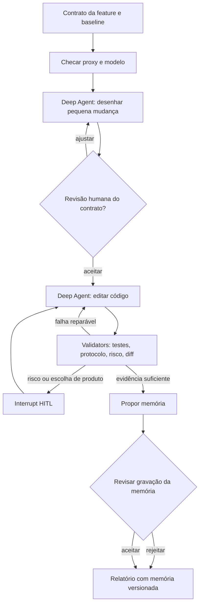

# Experimento 04 — Agentic Software Factory: validators, HITL e memória

**Status:** spec para implementação acompanhada; nenhuma execução da fábrica ou mudança no `mcps-catalog` foi realizada por este documento.  
**Data:** 2026-10-01.  
**Laboratório:** `graph-engineering-lab`. **Produto alvo:** `../mcps-catalog/laya-computer`.  
**Decisão do estudo:** uma feature, `preflight_plan`, implementada por um worker Deep Agents com modelo Codex via proxy local; orquestração e checkpoints em LangGraph; observação e avaliação em MLflow.

## 1. Pergunta, limite e evidência

Pergunta: **validators com autoridade real e memória seletiva tornam a implementação e o reparo de uma feature mais corretos e auditáveis, e colocam HITL nos pontos certos?** Esta POC demonstra mecanismos e revela falhas; uma feature não estima melhora geral de produtividade ou segurança.

O [Experimento 03](03_harness_reverse_engineering.md) é a linha de partida: o parecer de auto revisão não bloqueia a resposta, o teste de memória cobre uma regra em dois turnos, e a recuperação `top_k=3` não tem limiar. Este experimento deve produzir uma mudança observável: veredito inválido vira `unverified`, falha de validator impede conclusão, memória precisa ter evidência e pode ser rejeitada como obsoleta.

Três classes de evidência devem permanecer distintas: `fixture_sintetica`, `execucao_local` e `observacao_nativa`. Um teste com fixture não prova segurança ou sucesso em uma interface real. Registre `não medido` para custo, tokens ou latência que não forem efetivamente capturados.

## 2. Feature do produto: `preflight_plan`

Adicionar ao servidor MCP `laya-computer` uma tool **somente de análise estática**, antes de `run_plan`. Ela aceita um plano candidato e retorna problemas de contrato, riscos e lacunas de evidência. Não abre app, não chama Cua, não carrega Laya, não executa nem autoriza o plano. O agente chamador continua responsável por `inspect`, autorização e execução.

### Contrato proposto

```python
@srv.tool()
async def preflight_plan(plan: dict) -> dict:
    """Assess a candidate plan without observing or acting on the desktop."""
```

Receber `dict` permite devolver um erro estruturado quando `Plan.model_validate(plan)` falha. Se o SDK MCP rejeitar o payload antes da função, o teste de protocolo deve registrar esse comportamento e o contrato pode ser ajustado sem mascarar o erro.

Resposta versionada, sugerida:

```json
{
  "schema_version": 1,
  "status": "valid|invalid|unverified",
  "recommendation": "proceed_to_inspection|repair|human_review",
  "issues": [{
    "code": "MISSING_SUCCESS_EVIDENCE",
    "severity": "error|warning|review",
    "step_id": "select-photo",
    "evidence": "success predicate proves only view selection",
    "suggestion": "add a predicate for the intended result"
  }],
  "risk_factors": ["writes_user_data", "partial_observation"],
  "checks_run": ["plan_schema", "references", "reachability", "risk_rules"],
  "checks_not_run": ["live_accessibility", "runtime_effects"]
}
```

`status=valid` significa que os checks estáticos passaram; nunca equivale a execução aprovada ou objetivo cumprido. `recommendation` é orientação estruturada para o chamador, não um token de permissão. O caso `unverified` cobre falha interna de análise ou regra inconclusiva. A tool não deve prometer detectar semanticamente toda lacuna de sucesso: esse tipo de avaliação pode ser um validator separado, com incerteza explícita.

Checks mínimos para a feature:

1. `Plan.model_validate`, com erros sanitizados e códigos estáveis; nenhuma exceção contendo dados sensíveis no retorno.
2. Referências e alcançabilidade a partir de `first_step_id`; reportar etapas inalcançáveis e caminhos sem saída intencional clara. Não supor avanço implícito na ordem da lista: `next_step=None` encerra.
3. Revisar regras de risco explícitas: `set_value`, teclas potencialmente destrutivas, `allow_partial_observation`, predicados que só demonstram navegação, orçamento de ações/tempo/resgates e selector sem contexto suficiente. Classificar fatos estruturais deterministicamente; apresentar inferências sobre intenção como `review`.
4. Devolver resultado estável para plano inválido e para erro inesperado do analyzer. Erro inesperado produz `unverified`, nunca `valid`.

Arquivos do produto previstos: `laya-computer/laya_computer/preflight.py` (análise pura), `server.py` (registro da tool), `tests/test_preflight.py`, `tests/test_protocol.py` (a lista de tools hoje é exata), `README.md` e, se houver mudança observável de versão, `.claude-plugin/plugin.json`. Ler `../mcps-catalog/AGENTS.md` antes de alterar o produto. A árvore atual é a fonte de verdade se algum caminho mudar.

### Casos de aceitação do produto

| Caso | Resultado esperado |
| --- | --- |
| Plano mínimo válido com `verify` e predicado observável | Análise estática válida; execução continua não autorizada |
| `goal` ausente ou referência quebrada | `invalid` + issue estruturada |
| Etapa inalcançável | issue de alcançabilidade com `step_id` |
| `set_value` ou tecla de risco | `human_review` com fator de risco e justificativa |
| `allow_partial_observation=True` | revisão explícita do limite da evidência |
| Analyzer lança exceção controlada no teste | `unverified` e nenhuma aprovação por fallback |
| MCP real via stdio lista a nova tool | Schema e chamada testados sem UI/modelo |

## 3. A fábrica que produzirá a feature

**Deep Agents é o worker**, não o grafo inteiro. **LangGraph é o controlador** que define quando o worker pode avançar. Validators programáticos verificam artefatos e comandos; um validator semântico pode levantar suspeitas, mas não substitui resultados reproduzíveis. **MLflow observa**, não decide autorização.

Os arquivos atuais `src/deep_agents_graph.py` e `src/03-harness-reverse-experiment/deepagents_self_improving.py` montam grafos próprios em LangGraph. Eles servem como histórico do laboratório, mas **não demonstram** o ciclo de tools de `create_deep_agent`; este é um componente novo do experimento 04.



Estado mínimo do grafo, em `TypedDict` ou Pydantic: `feature_contract`, `target_ref`, `worktree_path`, `model_id`, `proxy_probe`, `worker_attempt`, `diff_paths`, `validation_results`, `risk_assessment`, `human_decisions`, `memory_candidates`, `memory_reads`, `final_status`. Guarde IDs e caminhos de artefatos grandes no estado; logs completos e diffs ficam fora do checkpoint. Cada `validation_result` tem `name`, `command_or_rule`, `exit_code`, `artifact_path`, `evidence_class` e `status=pass|fail|unverified`.

Ordem de trabalho para implementar a fábrica em `src/04-agentic-factory/`:

1. `contracts.py`: tipos de estado, findings e decisões. **Pronto quando:** fixture de cada status valida, inclusive `unverified`.
2. `proxy_probe.py`: round trip de tool calling com uma tool falsa e modelo concreto, sem tocar o produto. **Pronto quando:** retorna `AIMessage.tool_calls` com nome e argumentos corretos, a chamada da tool é observada, e uma segunda resposta usa o resultado. Registrar versão do proxy, modelo e trace. Falha aqui bloqueia o worker Deep Agents.
3. `worker.py`: `create_deep_agent(model=create_model("codex", model_id), ...)` com filesystem limitado ao checkout isolado, tools de leitura/teste e `checkpointer`. **Pronto quando:** alteração mínima em fixture ocorre por tool call real e é visível no diff.
4. `validators.py`: validação de escopo do diff, comandos de teste, protocolo MCP, formato das issues e risco. **Pronto quando:** um defeito injetado produz `fail` ou `unverified` e a aresta do grafo impede conclusão.
5. `graph.py`: nós e arestas de reparo, limites de tentativas, interrupções e retomada. **Pronto quando:** passa por `pass`, `fail→repair` e `human_review→resume` em fixtures independentes.
6. `memory.py`: candidatos, índice, recuperação e invalidação; nunca escrever diretamente no arquivo de memória pessoal do Codex. **Pronto quando:** entrada sem evidência é rejeitada e uma entrada contradita pelo código atual é marcada `stale`.
7. `trace.py`/`eval.py`: spans e scorers no MLflow. **Pronto quando:** cada passada mostra worker, validator, decisão humana e IDs de memória; o relatório deriva dos traces, sem números inventados.

Use um checkout isolado do `mcps-catalog`, preservando o `main` atual e a alteração não rastreada `speak/uv.lock`. A criação do checkout e a implementação do produto pertencem à fase de execução acompanhada. A spec por si só não altera esse repositório.

## 4. Primeiro gate: o proxy Codex precisa chamar tools

O laboratório separa os transportes em `proxy/codex.py` (Responses API) e `proxy/claude.py` (Messages API). `proxy/client.py` usa `ChatOpenAI(use_responses_api=True)` e `ChatAnthropic`; as libs fazem a serialização de tools, resultados e streaming. O proxy injeta autenticação e encaminha o protocolo nativo. Para Codex sem streaming no cliente, coleta a resposta nativa final `response.completed` do SSE obrigatório do upstream, preservando seus itens.

Os testes offline verificam o ciclo de tools com clientes LangChain reais e upstreams simulados. Isso não prova aceitação pelo endpoint de assinatura. Executar `proxy_probe.py` com um modelo concreto antes do worker; falha bloqueia a POC. Registrar a identidade do modelo e a classe de evidência. Não tratar os antigos experimentos com prompts textuais como evidência de tool calling.

```python
from proxy.client import create_model

model = create_model("codex", "gpt-6.1-sol")  # confirmar disponibilidade no probe
# Alternativa: create_model("claude", "claude-sonnet-4-6")
```

Não registrar credenciais, corpos brutos com segredos ou caminhos de autenticação em MLflow. Para o probe, registrar requisição e resposta **redigidas**, incluindo forma de `tool_calls`, `finish_reason` e consumo reportado; conferir se `usage` veio do upstream ou de estimativa do proxy.

## 5. Dois mecanismos de interrupt e HITL

### A. Interrupção antes de uma tool sensível, no Deep Agents

Use `interrupt_on` para uma tool de efeito real e estreito, por exemplo `commit_memory(candidate_id)` depois que o validator de memória preparou um candidato. O handler externo mostra diff da entrada, fonte e motivo. O agente não decide a própria aprovação. Durante a POC, a gravação se limita à memória experimental sob `src/04-agentic-factory/runs/<id>/memory/`.

O worker recebe apenas uma tool que solicita essa gravação; o diretório de memória fica fora das permissões de escrita de suas tools genéricas de filesystem/shell. A função `commit_memory` revalida `candidate_id`, digest e destino após a retomada. Caso contrário, o agente poderia contornar `interrupt_on` escrevendo o arquivo por outro caminho.

```python
from deepagents import create_deep_agent
from langgraph.checkpoint.memory import InMemorySaver
from langgraph.types import Command

worker = create_deep_agent(
    model=model,
    tools=[commit_memory],
    interrupt_on={"commit_memory": {"allowed_decisions": ["approve", "reject"]}},
    checkpointer=InMemorySaver(),
)
config = {"configurable": {"thread_id": run_id}}
result = worker.invoke({"messages": [{"role": "user", "content": task}]}, config=config)
if result.get("__interrupt__"):
    pending = result["__interrupt__"][0].value
    # Mostrar action_requests, argumentos e review_configs; esperar decisão humana.
    result = worker.invoke(
        Command(resume={"decisions": [{"type": "approve"}]}),
        config=config,
    )
```

Isto ilustra a forma da API, **não** é um script executável completo: `commit_memory`, `run_id`, `task` e o handler precisam ser implementados. Na execução real, aceitar decisão apenas após exibir a proposta concreta. `reject` deve trazer mensagem indicando que a tool não executou. Se houver múltiplas ações pendentes, enviar uma decisão por `action_request`, na mesma ordem. O `thread_id` deve ser o mesmo na retomada. `InMemorySaver` serve para teste em um processo; para reinício e inspeção entre sessões, usar um checkpointer persistente e testar a retomada.

### B. Interrupção de um marco de revisão, no LangGraph

Use um nó dedicado para revisar contrato, risco ou diff após validators. `interrupt()` devolve payload serializável; `Command(resume=...)` devolve a decisão ao nó. O nó reinicia desde o começo ao retomar: prepare e persista a proposta **antes** do nó, e deixe efeitos externos em um nó seguinte.

```python
from langgraph.types import interrupt

def review_gate(state: FactoryState) -> dict:
    decision = interrupt({
        "kind": "risk_review",
        "feature": state["feature_contract"]["name"],
        "finding_ids": [f["id"] for f in state["risk_assessment"]["findings"]],
        "diff_path": state["diff_path"],
        "choices": ["approve", "request_changes", "reject"],
    })
    return {"human_decisions": [decision]}

# Compilar o grafo com checkpointer; retomar pelo mesmo thread_id:
# graph.invoke(Command(resume={"choice": "request_changes", "note": "..."}), config)
```

O handler valida `choice`, o alvo e a versão do diff antes de aceitar; aprovação de um diff antigo não se aplica a uma revisão nova. Um resultado de risco inconclusivo vai para revisão humana. Uma falha objetiva de teste volta ao worker, com orçamento de reparos; não cria uma aprovação humana repetitiva. A comparação com práticas públicas de [Claude Code](https://www.anthropic.com/engineering/claude-code-auto-mode) e [OpenAI](https://developers.openai.com/api/docs/guides/agents/guardrails-approvals) é sobre **onde interromper e como limitar efeitos**, não sobre copiar seus classificadores internos.

Fontes da API: [Deep Agents HITL](https://docs.langchain.com/oss/python/deepagents/human-in-the-loop) e [LangGraph interrupts](https://docs.langchain.com/oss/python/langgraph/interrupts). Conferir versões instaladas ao implementar: em 2026-10-01 o ambiente do laboratório tinha `langgraph 1.2.12` e `langchain 1.4.2`; `deepagents` e `mlflow` não estavam instalados na `.venv` consultada.

## 6. Validators e decisão de risco

Contratos de resultado: `pass`, `fail`, `unverified`. O gate agrega assim: qualquer `fail` bloqueia; qualquer `unverified` sem `fail` pausa ou exige reparo da instrumentação; somente todos os checks requeridos em `pass` permitem o próximo estágio. O worker não pode alterar o resultado de um validator escrevendo um resumo.

| Validator | Evidência exigida | Escalonamento |
| --- | --- | --- |
| Escopo | Diff restrito ao plugin e arquivos esperados; sem segredo/credencial | Fora do escopo → HITL ou rejeição |
| Contrato MCP | Schema, nomes de tools e chamada stdio reais | Falha → reparo |
| Código | Testes do plugin, Ruff, checks do catálogo; registrar skips | Falha → reparo; skip crítico → `unverified` |
| Comportamento | Fixtures para casos da seção 2, incluindo erro do analyzer | Falha → reparo |
| Risco | Fatores com evidência do diff e da tool | Efeito externo/ambiguidade → HITL |
| Memória | Fonte, aplicabilidade, duplicação, validade frente ao código | Sem lastro ou stale → rejeitar |

O gate de risco considera probabilidade, alcance e reversibilidade, mas não inventa score numérico para a POC. Saídas: `routine`, `needs_human`, `blocked`, cada uma com motivos e evidência. `routine` exige operação dentro do checkout isolado e sem efeito externo; `needs_human` cobre mudança de contrato público, dependência, autorização para ação externa ou incerteza material; `blocked` cobre ação fora do escopo, segredo exposto e tentativa de contornar o gate. A decisão humana é registrada separadamente do veredito técnico.

Comandos do produto, a confirmar no checkout da execução: `uv run --project laya-computer pytest -q -rs laya-computer/tests`, `uv run --project laya-computer ruff check --config laya-computer/pyproject.toml laya-computer`, `python3 scripts/check_pins.py` e `python3 -m pytest -q -rs` na raiz. Teste stdio e resultados devem ser registrados por execução. A suíte portátil não requer UI, Photos ou pesos locais.

## 7. Memória experimental entre passadas

Separar **estado de execução** (checkpoint LangGraph), **artefatos do produto** (Git) e **memória reutilizável** (`MEMORY.md`). Para uma feature, criar três sessões com contexto novo: desenho, implementação, validação/reparo. O index `MEMORY.md` aponta para entradas curtas; cada entrada tem `id`, `claim`, `source_run`, `evidence_path`, `applies_to`, `created_at`, `revalidate_when`, `status=candidate|active|stale|rejected`. A entrada ativa não substitui inspeção do código atual.

Pipeline: extrair candidato do trace → validar evidência e valor futuro → deduplicar → HITL de gravação → salvar atomicamente → indexar. Na recuperação: filtrar por escopo → checar validade contra repo/ref atual → selecionar com justificativa → registrar `memory_id` lido e o efeito observado na decisão. Para testar invalidação, fornecer uma entrada que contradiz o código atual e exigir `stale` antes de usá-la. Para testar contaminação, incluir texto de instrução maliciosa em uma saída de tool sintética; ela deve permanecer dado não confiável e não virar regra.

Comparação controlada após a primeira passada: restaurar o **mesmo** ref e fixture em dois checkouts equivalentes, iniciar sessões novas com o mesmo modelo/configuração; braço A recebe `AGENTS.md` e código, braço B recebe os mesmos mais uma entrada ativa de memória. Pergunta observável: houve leitura pertinente e melhoria em reparo/decisão? Guardar diffs, traces e decisões humanas. Uma única comparação é demonstração de mecanismo; não declarar ganho estatístico.

## 8. MLflow e relatório

Habilitar `mlflow.langchain.autolog()` depois de checar compatibilidade instalada. Complementar com spans próprios para `validator`, `risk_gate`, `human_decision`, `memory_candidate`, `memory_read` e `memory_invalidate`. Associar `run_id`, `feature_id`, `target_ref`, `model_id`, versão do proxy, variante de memória e classe de evidência. Usar `mlflow.genai.evaluate()` com scorers de código para invariantes reproduzíveis; juiz LLM pode ser análise auxiliar, nunca aprovação automática. Ver [MLflow LangGraph tracing](https://mlflow.org/docs/latest/genai/flavors/langchain/autologging/) e [custom scorers](https://mlflow.org/docs/latest/genai/eval-monitor/scorers/custom/).

Relatório final mínimo: tabela de cada passada com input, ref, diff, validator, status, reparo, HITL, memória escrita/lida, trace MLflow e resultado. Métricas: número de passadas, falhas detectadas, falsos bloqueios observados, intervenções humanas, tempo e tokens/custo **se medidos**. Registrar manualmente onde a observação do usuário mudou o rumo do agente.

## 9. Roteiro de construção acompanhada

Um outro agente deve trabalhar **uma etapa de cada vez** e encerrar cada etapa com diff, comando executado, resultado e pergunta técnica específica para você. Seu papel é observar o código e decidir os marcos de produto/risco, não aprovar todo comando.

| Marco | O agente entrega para inspeção | Critério para seguir |
| --- | --- | --- |
| 0. Probe | Trace do ciclo real de tool calling via proxy | Tool call, resultado e segunda resposta verificados |
| 1. Contratos | `contracts.py` e fixtures de status | `fail`/`unverified` não viram aprovação |
| 2. HITL mínimo | Exemplo `interrupt_on` e `interrupt()` com retomada | Nenhum efeito ocorre antes de `approve`; `reject` é observado |
| 3. Produto | `preflight.py`, registro MCP, testes e README | Casos da seção 2, stdio, Ruff e testes passam |
| 4. Validators | Grafo devolve defeito ao worker e barra conclusão | Defeito injetado atravessa a aresta correta |
| 5. Memória | Candidato, revisão, recuperação e invalidação | Leitura útil e caso stale visíveis no trace |
| 6. Relatório | Artefatos, MLflow, limitações e custo observado | Toda conclusão aponta para evidência |

Antes de iniciar o marco 0, revisar com você o contrato exato da tool e a política de risco proposta. Depois, seguir os marcos com código inspecionável. O `mcps-catalog` pede branch e PR contra `main`; publicação/merge fica como decisão posterior. Esta spec não é autorização para rodar um plano de desktop, enviar dados externos ou instalar a nova tool para uso real.

## Fontes e estado conhecido

- Produto: [`../mcps-catalog/laya-computer/README.md`](../../mcps-catalog/laya-computer/README.md), [`plan.py`](../../mcps-catalog/laya-computer/laya_computer/plan.py), [`server.py`](../../mcps-catalog/laya-computer/laya_computer/server.py), [`test_protocol.py`](../../mcps-catalog/laya-computer/tests/test_protocol.py), [`AGENTS.md`](../../mcps-catalog/AGENTS.md), consultados em 2026-10-01.
- Laboratório: [`proxy/`](../proxy/README.md), [`requirements.txt`](../requirements.txt), [Experimento 03](03_harness_reverse_engineering.md), consultados em 2026-10-01.
- Documentação primária: [Deep Agents HITL](https://docs.langchain.com/oss/python/deepagents/human-in-the-loop), [LangGraph interrupts](https://docs.langchain.com/oss/python/langgraph/interrupts), [MLflow tracing](https://mlflow.org/docs/latest/genai/flavors/langchain/autologging/), [OpenAI guardrails](https://developers.openai.com/api/docs/guides/agents/guardrails-approvals), [Claude Code auto mode](https://www.anthropic.com/engineering/claude-code-auto-mode).
