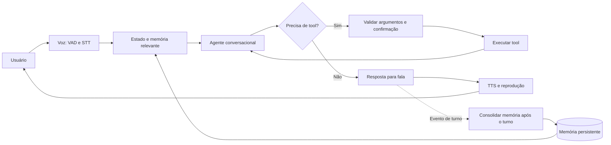

# Experimento 05 — Agentes de voz com grafos, memória e tools

Pesquisa em 03/10/2026. Status: **proposta para discussão**, sem implementação ou medições de voz. **Decisão do usuário: testar a configuração totalmente local mesmo nos 8 GB.** O worktree foi atualizado por `git pull --ff-only origin main`, de `3c00489` para `9036787`. Requisitos das vagas e funcionalidades dos produtos podem mudar. As recomendações de arquitetura e avaliação abaixo são nossas inferências; não são critérios de seleção publicados pela ElevenLabs.

Plano de execução acompanhado na IDE: [spec do experimento 05](05_voice_agents_spec.md).

## Direção recomendada

Construir um agente de atendimento que conclua **uma tarefa operacional real**, com conversa por voz, grafo LangGraph, poucas tools, memória entre sessões e um relatório reprodutível de qualidade, latência e custo. Caso candidato: atendimento e agendamento para um pequeno serviço de consultoria ou formação.

A pergunta central: **qual configuração consegue concluir essa tarefa, lembrar somente o que deve e responder com fluidez no orçamento disponível?**

O primeiro teste será **voz totalmente local**, em cascata STT → LLM → TTS conforme a opção Hugging Face indicada. Os 8 GB são uma condição experimental, não um veto. Primeiro observar a viabilidade e depois integrar tools/memória. Um comparativo com S2S nativo pode vir depois, se esse for o foco escolhido. Consulte o [glossário](../CONTEXT.md).

## O que as vagas pedem e como demonstrar

| Trilha pesquisada | Exigências publicadas | Evidência que este projeto pode produzir |
| --- | --- | --- |
| [FDE — Software Engineer — Brazil](https://elevenlabs.io/careers/6ce3306e-a546-4e11-83d6-3eaff5dd366b/forward-deployed-engineer-software-engineer-brazil) | Python, arquitetura, integração de APIs, comunicação e trabalho com clientes; projetos paralelos contam como experiência com clientes. Brasil, preferência São Paulo, viagens; português e inglês fluentes. | Problema levantado com usuário, requisitos, integração operacional, piloto, feedback e apresentação técnica em inglês. |
| [Full-Stack Engineer](https://elevenlabs.io/careers/6a530871-b6c6-4783-ac6b-69cc3b084192/full-stack-engineer) | Python, TypeScript/React, funcionalidades completas, APIs, cloud e armazenamento; valoriza projetos/GitHub. | Interface de voz, backend Python, sessões, persistência e testes relevantes. |
| [Full-Stack — Back-End Leaning](https://elevenlabs.io/careers/c7d59014-b918-4c15-ae33-79f5c9f2cf9f/full-stack-engineer-back-end-leaning) | Sistemas backend, integração, infraestrutura, testes e segurança. | Tools tipadas, idempotência, isolamento entre usuários, recuperação de falhas e traces. |
| [Research Engineer — Inference](https://elevenlabs.io/careers/2d7f9a7c-a9e6-4877-bb38-34e4d989054c/research-engineer-inference) | Serving ML em produção, otimização de latência/throughput/custo, quantização, GPU e ferramentas como CUDA/Triton/TensorRT ou vLLM/SGLang. | Profiling e comparação controlada de uma otimização; MLX no Mac cobre apenas parte dessa experiência. |
| [Research Engineer](https://elevenlabs.io/careers/3d650946-5ac2-4729-9ae4-129c43fcd0b5/research-engineer) | Treinamento/pós-treinamento, dados, arquitetura de modelos e benchmarks. | O projeto de integração deixa lacunas nessa trilha; seria necessário outro estudo de modelos/dados. |

Recomendação inicial: **FDE Brasil ou engenharia de produto/backend**, acrescentando disciplina de medição de Inference. Um piloto com alguém além do desenvolvedor torna o repertório mais próximo do trabalho publicado para FDE.

## Restrições verificadas

- Host atual: Apple M2, **8 GiB de memória**, consultado via `sysctl`; desempenho de áudio e modelos: **não medido**.
- Após o pull, este worktree contém a spec do experimento 04, os proxies nativos e a estrutura inicial de `src/04-agentic-factory/`. O relatório do 04 ainda lista implementação de contratos, probe, validators, worker, grafo e memória como pendentes; não tratar o scaffold como fábrica pronta.
- O grafo atual de `src/deep_agents_graph.py` passa por planejamento, execução e reflexão sequenciais. Serve como referência de estudo; portar todas essas fases para cada turno de voz adicionaria chamadas no caminho de resposta.
- `src/subscription_proxy.py` agora é um launcher compatível. `proxy/client.py` usa ChatOpenAI com Responses e ChatAnthropic com Messages, sem tradução manual de tools. `proxy/README.md` informa contratos offline e compatibilidade viva não verificada. Testar um ciclo real com modelo concreto antes de reutilizar assinaturas no agente de voz.
- A memória atual do experimento 03 usa sobreposição de palavras e top-k, sem excluir resultados de relevância zero. É referência para a comparação, não um mecanismo já validado para voz.

## O repositório Hugging Face e as alternativas

O [speech-to-speech](https://github.com/huggingface/speech-to-speech#apple-silicon-fully-local) documenta uma **cascata VAD → STT → LLM → TTS**. Seu preset Mac usa Parakeet, Qwen3-4B quantizado via MLX e Qwen3-TTS; recomenda planejar 16 GB ou mais. Por decisão do usuário, testar local nos 8 GB: começar por uma configuração leve e comparar o preset documentado como teste de pressão, dentro de limites de duração e recursos registrados. Suporte Apple Silicon não demonstra desempenho neste hardware.

| Opção | Papel proposto | Validação pendente |
| --- | --- | --- |
| Hugging Face speech-to-speech | Primeiro teste totalmente local escolhido pelo usuário; candidato para a aplicação. | Memória, PT-BR, interrupção e ligação com o grafo. |
| [LiveKit + adaptador LangGraph](https://docs.livekit.io/agents/models/llm/langchain/) | Alternativa para integrar o grafo: tools no grafo; voz e turnos na sessão. | Streaming apenas da resposta destinada ao usuário, cancelamento, checkpoint e adaptadores de fala local. |
| [Whisper via MLX Audio](https://github.com/blaizzy/mlx-audio/blob/main/docs/api-reference/stt.md) + [Kokoro PT-BR](https://huggingface.co/hexgrad/Kokoro-82M/blob/main/VOICES.md) | Candidato leve para STT/TTS; iniciar com Whisper multilíngue tiny e comparar small se necessário. | Uso simultâneo de RAM, precisão de nomes/datas, qualidade da pronúncia e tempo até playback. |
| [OpenRouter com tools](https://openrouter.ai/docs/guides/features/tool-calling) | Um LLM textual pequeno como controle remoto, com tools e streaming. | Modelo/provedor explícitos, disponibilidade da combinação, custo real, confiabilidade. |
| [ElevenLabs Custom LLM](https://elevenlabs.io/docs/eleven-agents/customization/llm/custom-llm) | Comparação posterior da camada de voz mantendo o mesmo backend/grafo. | Plano/créditos, endpoint acessível e autenticado, contrato SSE e comportamento de tools. |

Escolher **um runtime de voz para a aplicação** após o primeiro teste local, sem implementar LiveKit, Hugging Face e Pipecat ao mesmo tempo. O interesse em LiveKit decorre da integração documentada com grafos; não é uma comparação de desempenho já executada. O adaptador aceita grafo compilado e streaming `messages`/`custom`. STT/TTS locais ainda podem exigir adaptadores.

O teste local deve começar com áudio fixo e registrar reconhecimento → geração → síntese → reprodução, depois passar ao microfone com fones. Configuração leve candidata: Whisper multilíngue tiny/small, um LLM MLX pequeno quantizado com ID fixado e Kokoro. Comparar com o preset do projeto alterando uma variável por vez. Downloads ficam em cache reutilizável; registrar revisão dos modelos e ambiente isolado. A observação inicial do host foi aproximadamente 14 GiB livres em disco e 8,55 GiB de swap já usados; medir os deltas para não atribuir ao experimento a carga de outros aplicativos. Esses valores não são medições de inferência.

O [design de tools do Hugging Face](https://github.com/huggingface/speech-to-speech/blob/main/src/speech_to_speech/api/openai_realtime/README.md#tool-calling-design) distingue tools estruturadas nos backends API e chamadas locais extraídas de blocos de código. Medir os dois caminhos separadamente; não executar Python arbitrário emitido por modelo.

O [áudio do OpenRouter](https://openrouter.ai/docs/guides/overview/multimodal/audio) permite entrada/saída por Chat Completions. Nossa inferência: isso, isoladamente, não entrega toda a sessão conversacional com interrupções e controle de reprodução.

## Como aproveitar as assinaturas

1. Usar Codex/Claude existentes para desenvolvimento, elaboração de cenários e análise fora da conversa, dentro dos limites disponíveis.
2. Avaliar um executor persistente via SDK/CLI oficial como candidato para tarefas de fundo ou um perfil de LLM. Medir startup, streaming, tools e cancelamento antes de colocá-lo no turno de voz. A [página vigente sobre Claude Agent SDK](https://support.claude.com/en/articles/15036540-use-the-claude-agent-sdk-with-your-claude-plan) informa que a mudança anunciada foi pausada e que SDK/`claude -p` continuam consumindo limites da assinatura; rever antes da implementação.
3. Tratar os proxies históricos como integração experimental pendente. Não basear a viabilidade do MVP exclusivamente neles.
4. Se necessário, usar uma pequena verba OpenRouter com teto explícito. Assinatura ChatGPT e [faturamento da API OpenAI](https://help.openai.com/en/articles/9039756-managing-billing-for-chatgpt-and-the-api-platform) são separados.

Reaproveitamento de assinatura não implica API pública de áudio incluída. Se houver assinatura ElevenLabs, verificar separadamente acesso a Agents, minutos/créditos e API. Não houve consulta a contas ou consumo de créditos nesta pesquisa.

## Recorte funcional proposto

Caso candidato: **agente que esclarece regras e agenda um serviço**. A escolha depende do acesso a usuários para piloto.

Exemplo completo: “Quero uma sessão na sexta à tarde”. O agente consulta disponibilidade, oferece opções, entende “não, melhor sábado”, confirma data/fuso/serviço, registra uma reserva e informa o identificador retornado. Em outra sessão, pode recuperar uma preferência explícita de horário. A agenda continua sendo a fonte de verdade da reserva.

Quatro tools no máximo:

- `lookup_policy`: regras e descrição dos serviços em uma base pequena, versionada.
- `list_slots`: disponibilidade de um sistema de agenda de teste.
- `create_booking`: reserva com confirmação explícita e chave idempotente.
- `cancel_booking`: valida titularidade e confirmação antes da alteração.

Primeiro backend funcional em sandbox, depois uma integração real limitada ao piloto. Fixtures verificam comportamento; não contam como uso real. Para outra vertical, manter o mesmo tamanho: consulta de informação, consulta de estado e uma ação operacional verificável.

Interface inicial: microfone, reprodução, transcrição, estado da ação e relatório por sessão. Demonstrar sem depender de comandos internos. Uma UI React mais completa ajuda a trilha Full-Stack, mas depende da prioridade escolhida.

## Grafo proposto



Um agente conversacional pode ocupar vários nós de controle sem exigir múltiplos LLMs. Recuperação e validações simples podem ser determinísticas. Limitar ciclos de tools e tempo total; apenas texto público vai ao TTS, nunca planejamento, JSON de tools ou reflexão.

Somente o grafo executa as tools de negócio. O runtime de voz não deve repetir a mesma operação. Distinguir o ID de sessão de voz, thread do grafo, usuário e ação idempotente.

Ao interromper, cancelar geração/reprodução pendentes e rejeitar texto/áudio de turnos antigos. **Parar a fala não desfaz uma reserva já registrada.** Se o resultado se tornou incerto, consultar o estado da operação antes de tentar novamente; não anunciar sucesso ou cancelamento sem evidência. Novo turno pode corrigir a solicitação e exigir uma nova confirmação.

## Memória como experimento

Separar [memória curta e longa](https://docs.langchain.com/oss/python/langgraph/add-memory): estado de sessão/checkpoint, preferências entre sessões e estado operacional mantido pelas tools. Também distinguir base documental de memória sobre o usuário.

Começar com poucos fatos tipados, recuperação filtrada e armazenamento local simples. Campos propostos: usuário, tipo, conteúdo, turno de origem, data, validade, versão e estado `candidate|active|stale|rejected`. Não exigir grafo de conhecimento ou vector DB antes de demonstrar necessidade.

Salvar somente fatos explícitos ou confirmados; corrigir/substituir fatos antigos; permitir consultar e apagar memórias. Uma transcrição provisória ou uma resposta interrompida não deve virar preferência persistente. A consolidação fora do turno precisa checar versões para não sobrescrever uma correção mais nova.

Comparar memória ligada/desligada em novas sessões com o mesmo histórico preparatório. Medir conclusão da tarefa, perguntas repetidas, recuperação indevida, atualização, exclusão, tokens e latência. Incluir fato irrelevante, preferência corrigida, memória expirada e usuários diferentes. Se memória não ajudar, reportar isso.

## Instrumentação e critérios de sucesso

O [guia de latência do Hugging Face](https://github.com/huggingface/speech-to-speech/blob/main/docs/response-latency.md) mede geração de áudio, não reprodução no cliente; as etapas podem se sobrepor. Kokoro não possui atualmente toda a cobertura nativa de métricas de primeiro áudio. Instrumentar cliente e servidor, sem somar durações sobrepostas.

| Medida | Definição proposta |
| --- | --- |
| Latência audível | Fim da fala do usuário até início da reprodução da resposta no cliente. Timestamp de playback é um proxy; usar loopback/gravação para validação acústica. |
| Latência útil | Fim da fala até a resposta que resolve a solicitação ou pede a informação necessária. “Vou consultar” fica marcado como acknowledgment, não como conclusão. |
| Endpointing | Fim real da fala até o sistema fechar o turno; separar de STT e inferência. |
| Interrupção | Início da nova fala até parar a reprodução antiga; registrar interrupções falsas. |
| Tools | Seleção e argumentos corretos, evidência do resultado, duplicações e recuperação de erro. |
| Memória | Recall pertinente, ausência de vazamento, atualização e exclusão; qualidade com/sem memória. |
| Recursos | RAM do processo, pressão de memória/swap do sistema, startup, erros e custo por tarefa concluída. |

Usar relógio monotônico em cada processo e correlação de eventos. Não subtrair relógios de máquinas diferentes sem sincronização/medida de transporte. Guardar versões, modelos, quantização, parâmetros, contexto, provedor/roteamento, hardware e condição de rede.

Metas iniciais **propostas para negociação**, não medidas nem requisitos publicados da ElevenLabs: p50 ≤ 1,5 s e p95 ≤ 3 s para primeira resposta audível útil sem tools, com modelos aquecidos; parada após interrupção ≤ 300 ms; nenhuma duplicação de ação ou vazamento entre usuários nos cenários de teste. Respostas com tools têm latência e sucesso próprios. A viabilidade dessas metas será examinada no gate de hardware.

Plano pequeno: 20 cenários de conversa; triagem de configurações com amostra curta; pelo menos 100 turnos no perfil escolhido para um p95 exploratório, reportando tamanho da amostra, falhas e variabilidade. Cold start separado de warm. Não apresentar p99 robusto com amostra pequena. Contagens são metas de coleta, não resultados existentes.

Cenários obrigatórios: pausa longa, autocorreção de data/nome, ruído, sotaque, barge-in, tool lenta, timeout/erro, resposta antiga após cancelamento, confirmação ambígua, reserva duplicada, retomada em nova sessão, memória corrigida/apagada e troca de usuário. Simulação textual não substitui teste com áudio e pessoa.

## Etapas e evidência para avançar

| Gate | Trabalho delimitado | Evidência esperada |
| --- | --- | --- |
| 0 — Viabilidade local | Testar STT/TTS e LLM locais isolados e juntos; comparar configuração leve e preset HF. Validar tools/streaming do executor de assinatura somente se usado depois. | Áudio PT-BR inteligível, RAM/swap e tempos medidos; resultado negativo também é válido; escolher runtime para a aplicação. |
| 1 — Tarefa | Grafo textual com tools de sandbox, confirmação e idempotência. | Tarefa concluída, erro sem falso sucesso, cancelamento e retry sem duplicação. |
| 2 — Conversa | Voz integrada, streaming público, interrupção e traces. | Demo completa, tempo até playback e correção de turnos interrompidos. |
| 3 — Memória | Persistência seletiva, isolamento, correção/exclusão e avaliação A/B. | Relatório de benefício, custo e falhas da memória. |
| 4 — Piloto | Uma integração operacional e usuários externos voluntários. | Meta de 3–5 usuários e 10 sessões, feedback e pelo menos uma melhoria derivada do uso. |
| 5 — Comparação | Um segundo perfil; ElevenLabs se houver acesso/orçamento. | Mesmo conjunto de tarefas, relatório custo/qualidade/latência e decisão fundamentada. |

Perfis candidatos, em sequência: A) fala e LLM totalmente locais, escolhido pelo usuário; B) mesma fala + LLM de assinatura validado ou OpenRouter pequeno, como comparação; C) ElevenLabs + mesmo backend, se viável. Fixar o ID concreto de cada modelo ao escolhê-lo; não usar alias flutuante no benchmark.

Na comparação C, Custom LLM aceita Chat Completions ou Responses com SSE, exigindo serviço acessível pela plataforma. Isso não comprova compatibilidade com proxy histórico ou com autenticação de assinatura. Quando a plataforma devolver o controle de uma tool, definir explicitamente quem executa a ação para evitar duplicação.

Fora do primeiro corte: treinamento de S2S, clonagem de voz, vários agentes conversando a cada turno, telefonia paga, Kubernetes e migração ampla dos experimentos antigos. Esses itens só entram se ligados à trilha de vaga ou a uma necessidade demonstrada.

Entrega de portfólio proposta: demo de uma tarefa completa, execução reproduzível, diagrama, suite de cenários/fixtures, traces, resultados brutos redigidos, relatório comparativo e caso de uso explicado em inglês. Mostrar também uma interrupção, uma tool que falha e uma memória corrigida.

## Árvore de decisões — rodada 1

Decidido pelo usuário: testar voz totalmente local nos 8 GB e atualizar o worktree com o experimento 04. Demais escolhas continuam abertas; a pesquisa não ativa integrações nem consome créditos.

```text
Meta: experiência demonstrável para ElevenLabs
├── Decidido: primeiro teste totalmente local no Mac de 8 GB
├── Q1: trilha de vaga
│   └── depois: profundidade produto / integração / pesquisa de inferência
├── Q2: usuário e tarefa real
│   └── depois: tools, dados, fonte de verdade, confirmações e piloto
├── Q3: assinaturas, teto incremental e tempo disponível
│   └── depois: perfis, modelos, runtime e duração de cada etapa
└── Q4: idiomas do primeiro corte
    └── depois: STT/TTS, corpus e metas de qualidade
```

Recomendações para a rodada: FDE Brasil + backend; atendimento/agendamento com acesso a um usuário piloto; primeiro teste totalmente local, assinaturas para desenvolvimento e pequena verba opcional para comparação futura; PT-BR na aplicação e apresentação em inglês. Perguntar ao usuário antes de fechar as escolhas dependentes. Registrar ADR somente quando uma decisão com trade-off e custo relevante de reversão for aceita.
