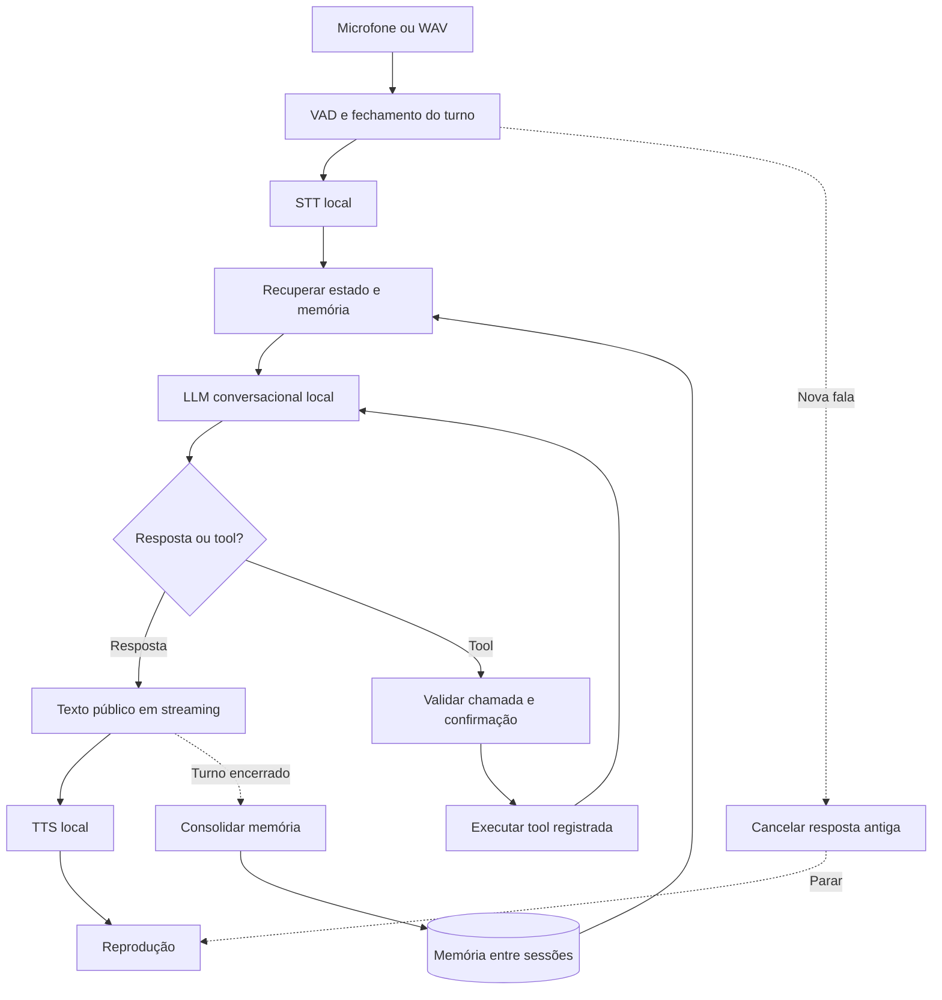

# Experimento 05 — S2S local com grafo, tools e memória

**Data:** 04/10/2026. **Status:** Implementado e validado via probes automatizados e runner interativo; Bloco 0 (STT/TTS/MLflow), Bloco 2 (LangGraph/Two-Phase Commit/Checkpoints SQLite), Bloco 3 (Streaming sintático/TTFB/Barge-in), Bloco 4 (Sandbox SQLite/Idempotência/SAGA/Streaming antecipado) e Bloco 5 (Kokoro ONNX PT-BR natural e Runner S2S).

**Decisões do usuário:** começar com voz totalmente local no Mac M2 de 8 GB; aproveitar o laboratório atualizado; implementar próximo da IDE, observando o código e tomando pequenas decisões.

**Objetivo:** construir e entender um agente de voz que conclua uma tarefa com tools, preserve memória útil entre conversas e permita explicar os trade-offs de qualidade, latência e recursos. Produzir evidências relevantes para engenharia de produto/backend e FDE na ElevenLabs.

Pesquisa, vagas e fontes: [escopo pesquisado](05_voice_agents_scope.md). Vocabulário: [CONTEXT.md](../CONTEXT.md).

## 1. Pergunta e recorte

**É possível manter uma conversa útil, com uma ação verificável e memória seletiva, usando modelos locais neste Mac de 8 GB? Qual parte limita a experiência?**

No primeiro corte, S2S significa aplicação de fala para fala em cascata: VAD → STT → LLM → TTS. Isso corresponde ao [projeto Hugging Face escolhido como referência](https://github.com/huggingface/speech-to-speech). Um modelo S2S nativo é uma comparação posterior, não uma dependência para começar.

O experimento aceita resultado negativo: pode concluir que a configuração cabe, mas responde devagar; que a voz funciona, mas tools falham; ou que uma configuração não cabe sob a carga observada. Distinguir esses resultados de erro de instalação ou integração.

Uma aplicação, um agente conversacional, um grafo e no máximo quatro tools. Comparações remotas só entram depois da baseline local. Não fazer treinamento, telefonia ou um sistema multiagente amplo neste corte.

## 2. Como vamos implementar juntos

Cada bloco tem o ciclo **explicar → editar um recorte → executar → observar → decidir**.

1. Abrir na IDE os arquivos que serão modificados e explicar suas responsabilidades.
2. Informar a mudança esperada e a decisão pequena do bloco; usar uma recomendação explícita quando houver alternativas.
3. Implementar apenas o bloco combinado. Não criar antecipadamente uma árvore de arquivos vazios.
4. Mostrar o diff e executar o cenário de aceitação; registrar saída e resultado observado.
5. Explicar uma dúvida concreta no código: quem chama quem, onde o estado muda, onde se mede tempo ou como a falha é tratada.
6. Registrar o resultado no diário e aguardar o feedback do usuário antes do próximo bloco.

Esse acompanhamento é a forma de trabalho escolhida, não um gate obrigatório para cada comando rotineiro. Dentro de um bloco autorizado, leituras, edições e verificações seguem normalmente. Se o usuário pedir avanço autônomo, o pedido redefine o ritmo.

Sem commits, publicação, gastos de API ou ativação de integrações externas por implicação desta spec. A entrega atual é o desenho; instalações e execução dos modelos pertencem ao primeiro bloco de implementação.

## 3. Baseline e reaproveitamento do experimento 04

O pull de `origin/main` avançou este worktree de `3c00489` para `9036787`, sem conflitos. Ele trouxe spec/scaffold do 04 e proxies separados. Foram executados **5 testes offline do proxy, todos aprovados**; nenhum usa inferência remota. Compatibilidade com assinaturas em execução real continua não verificada.

Reaproveitar:

- `proxy/client.py`: criação dos clientes nativos de cada provedor, se um perfil com assinatura for escolhido depois.
- `proxy/tests/`: referência para testar o ciclo de tools, IDs e streaming.
- [Spec do 04](04_agentic_software_factory_spec.md): estados explícitos de validação e separação entre estado, artefatos e memória.
- [Diário do 04](../src/04-agentic-factory/EXPERIMENT_REPORT.md): decisões de validators determinísticos e implementação acompanhada.

Não transplantar a fábrica de software para cada turno de voz. O scaffold do 04 ainda não implementa worker/grafo/memória. Memória de preferências do usuário de voz é um domínio diferente de heurísticas reutilizáveis de engenharia.

## 4. Configurações locais candidatas

| Perfil | Componentes | Papel |
| --- | --- | --- |
| `local_light` | Whisper multilíngue tiny via MLX Audio; [Qwen3-1.7B-4bit](https://huggingface.co/mlx-community/Qwen3-1.7B-4bit); [Kokoro MLX](https://huggingface.co/mlx-community/Kokoro-82M-bf16) com voz PT-BR | Primeiro candidato: menor carga para observar o ciclo completo. |
| `local_hf_preset` | Preset Apple Silicon do speech-to-speech, com Qwen3-4B quantizado e os modelos de fala definidos pelo projeto | Comparação com a opção indicada pelo usuário; medir sob 8 GB mesmo com recomendação maior de memória. |
| `hybrid_control` | Mesmo STT/TTS local, com um LLM de assinatura validado ou OpenRouter com modelo/provedor fixados | Controle posterior para separar limitações do LLM local das limitações de áudio/grafo. |
| `elevenlabs_control` | Backend/grafo reaproveitado via Custom LLM e voz ElevenLabs | Etapa opcional posterior, vinculada a acesso e orçamento. |

O checkpoint de Whisper proposto é `mlx-community/whisper-tiny-asr-fp16`, documentado na [API STT MLX Audio](https://github.com/blaizzy/mlx-audio/blob/main/docs/api-reference/stt.md). Validar idioma e precisão antes de comparar small. O [catálogo Kokoro](https://huggingface.co/hexgrad/Kokoro-82M/blob/main/VOICES.md) documenta PT-BR; testar pronúncia no runtime escolhido.

Modelos são candidatos, não escolhas comprovadas. No bloco 0, conferir flags/imports da versão instalada e fixar versões/revisões; não copiar opções de CLI não verificadas. Medir a baseline com histórico curto e sem raciocínio prolongado, quando a configuração suportar esse modo. Registrar a configuração efetivamente aceita.

Observar pressão de memória, pico do processo, swap antes/depois e espaço em disco. A máquina já tinha swap em uso antes do teste; não atribuir toda a memória do sistema ao agente. Definir limites do ensaio antes de executar: proposta inicial de 30 s por resposta e mínimo de 4 GiB livres em disco; exceder registra o motivo e encerra apenas processos do experimento. Não fechar aplicativos do usuário.

## 5. Arquitetura funcional



O runtime de voz controla áudio, turn-taking e interrupção. O grafo controla conversa, tools e persistência da tarefa. Um resultado de tool é evidência para a resposta; texto do LLM não é evidência de uma ação concluída.

**Decisão do bloco 2:** como integrar o grafo depois de observar a baseline HF. Preferir manter o runtime HF se permitir integrar com controle claro de streaming/cancelamento. Caso isso exija refazer sua orquestração, avaliar o [adaptador oficial LiveKit/LangGraph](https://docs.livekit.io/agents/models/llm/langchain/) mantendo os modelos locais. Escolher um caminho para implementar, documentando o custo visto no código.

Instruções, tools e execução de ações pertencem a um único controlador. Evitar dois agentes executando a mesma tool, um no runtime de voz e outro no grafo. Apenas conteúdo destinado ao usuário chega ao TTS.

## 6. Caso de uso e tools

**Vertical proposta, ainda aberta:** atendimento e agendamento de um pequeno serviço. Escolher um usuário piloto antes de implementar as tools de negócio. Se não houver acesso a esse usuário, começar com atendimento do laboratório: consulta documental, estado de tarefa e criação de rascunho local.

Contrato do caso de uso:

- Uma pessoa descreve o que precisa por voz.
- O agente consulta uma fonte de verdade, pede dados faltantes e propõe uma ação.
- O usuário confirma os parâmetros relevantes antes da alteração.
- O agente executa, verifica o resultado e responde com sua evidência.
- Em uma nova sessão, pode usar uma preferência explícita, atualizada e ligada à mesma pessoa.

Para agendamento: `lookup_policy`, `list_slots`, `create_booking`, `cancel_booking`. Primeiro um backend próprio em sandbox; integração externa somente quando escolhida para o piloto.

Tools têm argumentos tipados, saída estruturada, erro explícito e chave idempotente quando alteram estado. Só executar chamadas da lista registrada. Se o backend local emitir código como formato de chamada, converter apenas a representação permitida para argumentos; nunca executar Python arbitrário do modelo.

No máximo três ciclos de tools por turno, como limite inicial configurável. Chamadas inválidas produzem reparo delimitado ou informação de falha; não viram sucesso por fallback.

## 7. Contratos mínimos de estado e eventos

Definir tipos antes do primeiro grafo, sem implementar um framework próprio:

| Contrato | Campos principais |
| --- | --- |
| `VoiceTurn` | `session_id`, `turn_id`, `user_id`, `transcript`, `status` |
| `ConversationState` | mensagens, tarefa pendente, proposta de ação, confirmação, referências de memória, resultados de tools |
| `ActionProposal` | ID, tool, argumentos normalizados, versão e resumo apresentado ao usuário |
| `ToolResult` | chamada/ação, `status=success|failure|unknown`, dados/evidência, erro e possibilidade de retry |
| `MemoryFact` | usuário, conteúdo/tipo, origem, versão, validade e lifecycle |
| `TraceEvent` | run/sessão/turno, nome, tempo monotônico, componente, status e metadados redigidos |

`unknown` representa resultado operacional incerto, por exemplo conexão perdida após envio. Antes de repetir uma escrita, consultar/reconciliar o ID da ação. Validação determinística usa `pass|fail|unverified`; incerteza não autoriza anúncio de sucesso.

Uma confirmação só vale para a versão e os argumentos apresentados. Se o usuário mudar dia/serviço, a confirmação antiga não vale. A thread do grafo persiste a sessão; `user_id` delimita memória entre sessões. Uma transcrição de voz não autentica a pessoa; no piloto web, a identidade vem da sessão da aplicação.

**Resiliência e Checkpointers do LangGraph**:
A sessão de conversação é respaldada por um checkpointer persistente (`AsyncSqliteSaver`/`SqliteSaver` local em `.artifacts/checkpoints.db`). A cada superstep do grafo (nó do agente, nós de tools, proposta de ação), o estado é persistido atomicamente vinculado ao `thread_id`. Em caso de desconexão, queda de transporte (WebRTC) ou recarregamento do cliente, o agente retoma o `thread_id` restaurando o histórico de mensagens, propostas pendentes (`ActionProposal`) e estado operacional, sem exigir repetição de informações nem perder propostas em fase de confirmação.

## 8. Interrupção, cancelamento e streaming

- Antes de integrar grafo/tools, usar turnos explícitos ou push-to-talk para isolar o ciclo de áudio.
- Depois habilitar VAD e testar pausas, ruído, fechamento prematuro e barge-in.
- Toda geração e todo chunk de áudio pertencem a um `turn_id`; descartar resposta atrasada de turno cancelado.
- Parar reprodução não desfaz uma escrita concluída. Persistir o resultado real da ação, mesmo se a resposta falada for interrompida.
- Não concluir automaticamente uma tool pendente após uma correção do usuário. Revalidar os parâmetros e a confirmação aplicável.
- Guardar no histórico o conteúdo efetivamente reproduzido, ou marcá-lo como parcial; não assumir que o usuário ouviu todo o texto gerado.
- Avisos como “vou consultar” são eventos separados de resposta útil; não usá-los para esconder a latência da tarefa.

## 9. Memória

Três fontes distintas: checkpoint para continuar a conversa; memória seletiva sobre o usuário para próximas sessões; tools para estado operacional atual.

Memória mínima: preferências explícitas e fatos úteis com origem e validade. Começar com armazenamento local simples e recuperação filtrada por usuário/relevância. Não adicionar embeddings ou knowledge graph antes de observar uma necessidade.

Ciclo: propor `candidate` → validar origem/aplicabilidade → ativar `active`; correção ou validade vencida marca `stale`; proposta inadequada vira `rejected`. Atualizações carregam versões para impedir que uma consolidação atrasada restaure um fato antigo. Não persistir inferências sobre a pessoa a partir de voz ou de texto incompleto.

Consolidar depois do turno; se o usuário corrigir uma informação durante a tarefa, atualizar o estado de sessão imediatamente. Oferecer consulta/correção/exclusão da memória. Esses controles podem começar por texto na UI, antes de virarem comandos por voz.

Avaliação A/B: mesmas tarefas e preparação, novas sessões, memória ligada/desligada, ordem alternada. Observar conclusão, perguntas repetidas, tokens, latência e erros. Incluir uma memória irrelevante, uma corrigida, uma excluída e dois usuários distintos.

## 10. Medições e aceitação

Registrar cold start e warm separadamente. Medir componentes isolados e o ciclo integrado; não somar etapas sobrepostas. O [guia HF](https://github.com/huggingface/speech-to-speech/blob/main/docs/response-latency.md) diferencia geração de áudio de reprodução e tem cobertura desigual entre backends.

Eventos propostos: fim da fala de referência, fim detectado do turno, transcrição disponível, primeiro token público, tool iniciada/concluída, primeiro áudio gerado, primeiro áudio reproduzido, nova fala e reprodução parada.

| Critério | Aceitação |
| --- | --- |
| Voz local | Um WAV entra, transcrição/resposta/áudio saem usando só inferência local; registrar modelo/configuração. Depois repetir com microfone. |
| Grafo | Resposta textual e ciclo de tool observáveis, sem executar ação duas vezes. |
| Interrupção | Resposta antiga para; chunks atrasados não voltam a tocar; estado da ação permanece verificável. |
| Ação | Confirmação vinculada a parâmetros; resultado real ou erro explícito; retry sem duplicação. |
| Memória | Recuperar preferência em nova sessão, corrigir/apagar, não recuperar dados de outra pessoa. |
| Recursos | RAM/swap/disco observados, duração dos ensaios e falhas registrados. |
| Utilidade | Piloto avalia uma tarefa concreta; fixture e conversa com desenvolvedor são identificadas separadamente. |

Latência audível = fim da fala → começo da reprodução. Latência útil = fim da fala → conteúdo necessário à tarefa. Timestamp do player é proxy de audibilidade, a validar com gravação/loopback. Relógios de processos distintos precisam de referência/sincronização, não subtração ingênua de timestamps.

As metas p50 ≤ 1,5 s e p95 ≤ 3 s sem tools, e interrupção ≤ 300 ms, são **aspirações iniciais**, não garantias nem critérios eliminatórios da baseline. Primeiro medir, depois negociar metas plausíveis. Reportar latência de tools separadamente, tamanho da amostra, falhas e intervalos/variabilidade disponíveis.

Corpus inicial proposto: 20 cenários, com áudio PT-BR, datas, nomes, pausa, autocorreção, ruído, tool lenta/falhando, resposta atrasada, retomada e memória corrigida. Triagem curta antes de pelo menos 100 turnos no perfil escolhido; não apresentar p99 confiável com amostra pequena. Áudio sintético é fixture e precisa de complemento com fala humana.

## 11. Blocos de implementação na IDE

| Bloco | Arquivos a introduzir quando necessários | Execução observável | Pequena decisão ao terminar |
| --- | --- | --- | --- |
| 0 — Ambiente e componentes | `pyproject.toml`, `voice_lab/config.py`, `probes/components.py` | STT, LLM e TTS isolados; recursos e versões. | Manter perfil leve ou testar primeiro o preset HF? |
| 1 — Fala para fala | `probes/local_voice.py`, `voice_lab/trace.py` | Um WAV e uma conversa curta; tempos até geração/playback. | Qual gargalo vamos atacar primeiro? |
| 2 — Grafo textual | `voice_lab/state.py`, `voice_lab/graph.py`, `voice_lab/checkpoints.py`, tool de consulta | Estado antes/depois de cada nó, ciclo da tool, persistência por `SqliteSaver` e recuperação de sessão após queda. | Resiliência de propostas pendentes confirmada. |
| 3 — Voz, Streaming e Event-Driven | `voice_lab/events.py`, `voice_lab/audio_stream.py`, `probes/voice_event_probe.py` | Pipeline assíncrono event-driven (VAD → STT → Grafo → Chunker → TTS), TTFB de áudio, interrupção por barge-in sem perda de transações SAGA concluídas e traces no MLflow. | Calibração de threshold de VAD e granularidade do chunker de texto. |
| 4 — Ação verificável | `voice_lab/tools.py`, backend sandbox e testes de ação | Confirmação, escrita, erro e retry idempotente. | Qual integração real traz valor ao piloto? |
| 5 — Memória | `voice_lab/memory.py`, testes de memória | Duas sessões, correção/exclusão e isolamento. | Que fatos demonstraram utilidade e devem permanecer? |
| 6 — Avaliação | `eval/scenarios.jsonl`, `eval/run_suite.py`, relatório | Corpus reproduzível e comparação com/sem memória. | Ajuste de qualidade/latência com maior benefício observado. |
| 7 — Piloto e comparação | UI mínima, integração escolhida, configuração de controle | Uso por outras pessoas e uma melhoria derivada de feedback. | Vale comparar assinatura, OpenRouter ou ElevenLabs agora? |

Os nomes são propostos; revisá-los com o código no bloco correspondente. A tool inicial é determinística e de leitura. A camada de voz pode reutilizar o runtime HF sem reconstruir VAD/transporte; a escolha do adaptador ocorre depois de inspeção, não por suposição desta spec.

## 12. Organização futura dos arquivos

```text
src/05-voice-agents/
  pyproject.toml          # ambiente isolado e versões resolvidas
  voice_lab/             # aplicação, criada aos poucos
  probes/                # ensaios pequenos antes da integração
  tests/                 # contratos de ações, cancelamento e memória
  eval/                  # cenários e execução reprodutível
  .artifacts/            # runs locais ignorados pelo Git
  EXPERIMENT_REPORT.md   # decisões e evidência por bloco
```

Cache de modelos fica fora do Git e é reutilizado entre runs. Fixtures pequenas/publicáveis e resultados redigidos podem entrar no repositório; áudio de piloto, dados pessoais, credenciais e caches permanecem locais. Adicionar regras de ignore antes de gerar artefatos.

Diário por bloco: pergunta; arquivos/diff; comando/configuração; classe de evidência (`fixture_sintetica`, `execucao_local`, `piloto_real`); resultado; métricas ou `não medido`; decisão do usuário; próximo recorte. Não registrar tokens de autenticação ou corpos privados de requests.

## 13. Entrega final e escolhas abertas

Entrega: demo de tarefa completa, diagrama, código executável com ambiente resolvido, suite de cenários, traces redigidos, comparativo e explicação curta em inglês. Mostrar uma interrupção, uma tool que falha e uma preferência corrigida, além do caso de sucesso.

Escolhas a resolver perto do código, no bloco correspondente:

- Vertical e usuário do piloto, antes das tools de negócio.
- HF integrado ao grafo ou LiveKit com modelos locais, após a baseline de voz.
- Perfil/modelos finais e tuning, a partir das medições do Mac.
- Política de memória, a partir de exemplos observados.
- Assinaturas disponíveis e teto de API, somente antes de um perfil remoto.

**Próximo recorte:** bloco 0, abrir o ambiente e um único probe; explicar STT/LLM/TTS e executar componentes locais separadamente. Não implementar o restante da aplicação em lote.
