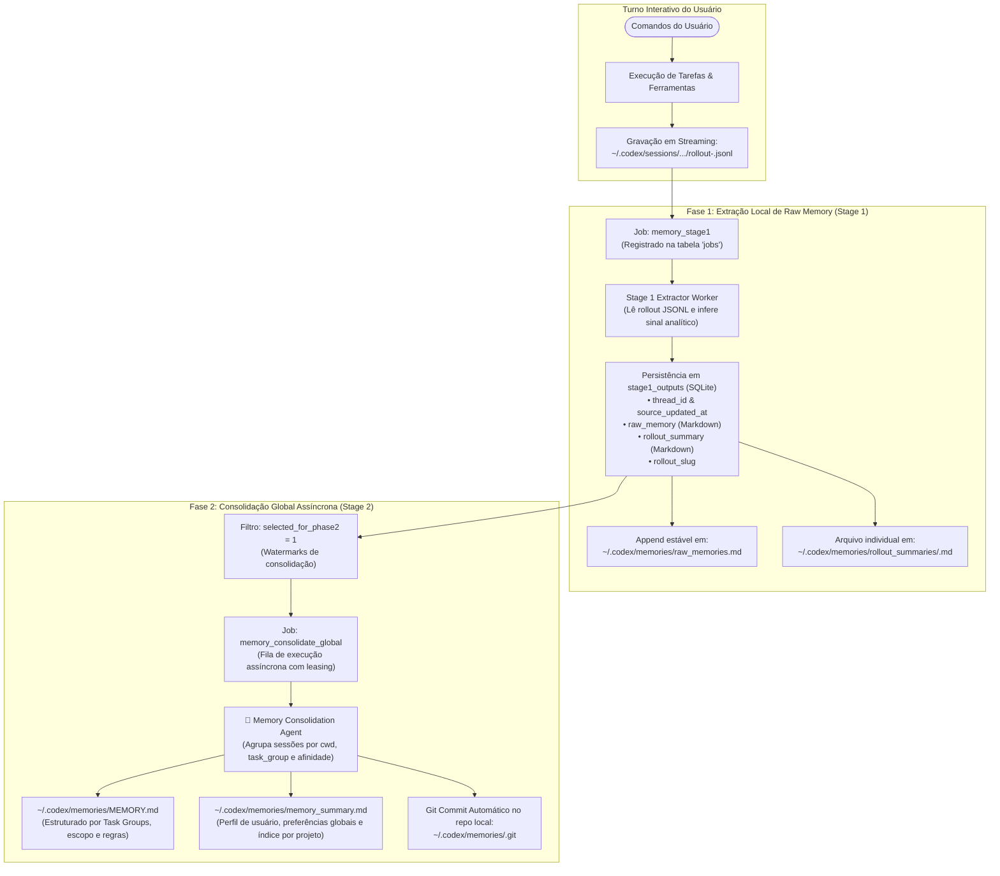
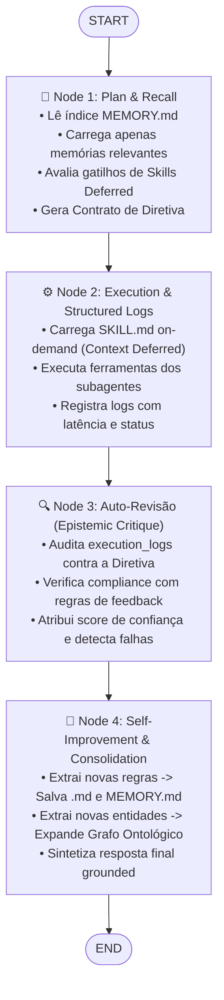

# 🧠 Estudo Aprofundado: Geração e Carga de Memória, Context Deferred e Auto-Revisão em DeepAgents

**Autor:** Matheus Borges  
**Repositório:** `graph-engineering-lab`  
**Experimento:** `src/03-harness-reverse-experiment`  
**Data:** Setembro de 2026  
**Status:** Implementado, Validado em 2 Turnos e Funcional  

---

## 📌 Sumário Executivo

Este documento disseca a engenharia reversa de dois dos mecanismos mais sofisticados presentes no **Claude Code CLI** e no **OpenAI Codex CLI**:
1. **Geração e Carregamento de Memória Persistente** (como o modelo aprende preferências e regras de projeto entre turnos).
2. **Context Deferred & Progressive Disclosure** (como evitar o inchaço de contexto sem perder acesso a dezenas de ferramentas e skills).
3. **Replicação Arquitetural em DeepAgents (LangGraph)** com:
   - Um índice mestre `MEMORY.md` e arquivos estruturados `<slug>.md` com YAML frontmatter.
   - Um catálogo diferido de skills com carregamento sob demanda (`load_skill`).
   - Um subsistema de **Logs Estruturados de Ação**.
   - Um nó de **Auto-Revisão (Crítica Epistêmica)** que audita a execução antes da resposta ao usuário.
   - Um fluxo contínuo de **Self-Improvement** que consolida novas memórias e expande a ontologia.

---

## 1. Como a Memória de Usuário é Gerada e Carregada no Claude Code e Codex

### 1.1 No Claude Code CLI (Sistema de Auto-Memory)
A análise dos payloads de 474 KB capturados pelo nosso proxy MITM revelou o protocolo exato da Anthropic para persistência:

```
~/.claude/projects/<project-slug>/memory/
├── MEMORY.md                 <--- Master Index (Injetado em TODOS os turnos, < 200 linhas)
├── feedback-db-rules.md      <--- Specialized Memory File
├── user-profile.md           <--- Specialized Memory File
└── project-deadlines.md      <--- Specialized Memory File
```

#### A. Estrutura Canônica de cada Arquivo de Memória (`<slug>.md`)
```markdown
---
name: short-kebab-case-slug
description: one-line summary used to decide relevance in future conversations
metadata:
  type: user | feedback | project | reference
---

[Regra, Preferência ou Fato Aprendido]

**Why:** [Motivação ou incidente que originou a regra]
**How to apply:** [Condições e escopo de ativação]

**Related:** [[outro-slug]]
```

#### B. Os 4 Tipos Canônicos de Memória:
1. **`user`**: Perfil técnico, experiência, linguagem preferida, papel na equipe.
2. **`feedback`**: Correções explícitas (*"não use mocks aqui"*) ou confirmações silenciosas (*"essa abordagem agrupada foi perfeita"*).
3. **`project`**: Decisões de negócio não deriváveis do código (ex: congelamento de branch, migrações de compliance).
4. **`reference`**: Ponteiros para sistemas externos (tickets no Linear, dashboards no Grafana).

#### C. Regras de Exclusão Estritas ("O que NÃO salvar"):
- O harness proíbe categoricamente salvar padrões de código que já existem nos arquivos, histórico de git (`git log` é autoritativo) ou passos efêmeros de debugging da conversa atual.

#### D. Mecanismo de Carregamento (Progressive Disclosure de Memória):
- O agente não lê todas as memórias. Ele recebe apenas o índice de 1 linha de cada entrada em `MEMORY.md`.
- Se uma instrução ou tarefa corresponder a uma entrada do índice, o agente usa a ferramenta `Read` para abrir especificamente o arquivo `<slug>.md` correspondente.

---

### 1.2 No OpenAI Codex CLI: A Arquitetura do Memory Raw e do Consolidation Agent

Enquanto o Claude Code adota uma abordagem puramente baseada em LLM inline (o próprio modelo do turno atual decide e invoca ferramentas de escrita/edição), a engenharia reversa do executável do **OpenAI Codex** e a inspeção forense de `~/.codex/` revelaram uma arquitetura de nível de engenharia de software muito mais robusta: **um pipeline assíncrono em duas etapas (Stage 1 e Stage 2) operado por um banco SQLite relacional, uma fila distribuída de jobs com leases e um repositório Git local dedicado**.



#### A. A Estrutura Física em Disco (`~/.codex/memories/`)
A pasta `~/.codex/memories/` é tratada pelo Codex como uma base de conhecimento isolada e versionada:
```
~/.codex/
├── memories_1.sqlite            <--- Banco relacional com esquemas de jobs e estágios
├── memories/
│   ├── .git/                    <--- Repositório Git interno (cada consolidação gera um commit!)
│   ├── raw_memories.md          <--- Merge contínuo e estável de todos os raw memories
│   ├── MEMORY.md                <--- Consolidação de médio nível por Task Groups
│   ├── memory_summary.md        <--- Sumário global de alto nível (perfil, preferências, projetos)
│   └── rollout_summaries/       <--- Arquivos markdown de sumário de cada rollout individual
│       ├── 2026-09-05T18-32-15-tau_intent_rebuild.md
│       └── 2026-09-25T10-54-01-laya_ultrafast_study.md
```

#### B. O Esquema do Banco SQLite (`~/.codex/memories_1.sqlite`)
A orquestração do pipeline é 100% transacional e gerenciada por três tabelas principais no SQLite:

1. **Tabela `stage1_outputs` (Armazenamento dos Raw Memories)**:
```sql
CREATE TABLE stage1_outputs (
    thread_id TEXT PRIMARY KEY,
    source_updated_at INTEGER NOT NULL,
    raw_memory TEXT NOT NULL,
    rollout_summary TEXT NOT NULL,
    rollout_slug TEXT,
    generated_at INTEGER NOT NULL,
    usage_count INTEGER,
    last_usage INTEGER,
    selected_for_phase2 INTEGER NOT NULL DEFAULT 0,
    selected_for_phase2_source_updated_at INTEGER
);
CREATE INDEX idx_stage1_outputs_source_updated_at 
    ON stage1_outputs(source_updated_at DESC, thread_id DESC);
```

2. **Tabela `jobs` (Fila de Tarefas Assíncronas com Leases e Retry)**:
```sql
CREATE TABLE jobs (
    kind TEXT NOT NULL,               -- 'memory_stage1' ou 'memory_consolidate_global'
    job_key TEXT NOT NULL,            -- thread_id específico ou 'global'
    status TEXT NOT NULL,             -- 'pending', 'running', 'done', 'failed'
    worker_id TEXT,
    ownership_token TEXT,
    started_at INTEGER,
    finished_at INTEGER,
    lease_until INTEGER,
    retry_at INTEGER,
    retry_remaining INTEGER NOT NULL, -- padrão: 3 tentativas com backoff
    last_error TEXT,
    input_watermark INTEGER,
    last_success_watermark INTEGER,
    PRIMARY KEY (kind, job_key)
);
CREATE INDEX idx_jobs_kind_status_retry_lease 
    ON jobs(kind, status, retry_at, lease_until);
```

3. **Tabela `consolidation_progress` (Rastreamento de Watermarks)**:
```sql
CREATE TABLE consolidation_progress (
    singleton INTEGER PRIMARY KEY CHECK (singleton = 1),
    max_thread_count INTEGER NOT NULL DEFAULT 0
);
```

#### C. Anatomia de um "Raw Memory" do Codex
Diferente de um simples log de chat, o **Raw Memory** gerado no Stage 1 é um documento analítico altamente estruturado. Cada bloco de sessão em `raw_memories.md` e na coluna `raw_memory` possui:

```markdown
## Thread `01a072d7-b857-78a0-8e7c-574e76da5e6d`
updated_at: 2026-09-05T19:36:03+00:00
cwd: /Users/matheusborges/github/tau-intent
rollout_path: /Users/matheusborges/.codex/sessions/.../rollout-...jsonl
rollout_summary_file: 2026-09-05T18-32-15-tau_intent_v2_adapter_rebuild.md

---
description: Reconstrução v2 do tau-intent com gates acionáveis e checkpoints auditáveis.
task: rebuild tau-intent v2 general adapter mechanism
task_group: tau-intent mechanism reconstruction
task_outcome: success
cwd: /Users/matheusborges/github/tau-intent
keywords: tau-intent, SPEC-V2, Adapter, gate, typed store, checkpoint, retrieval
---

### Task 1: Reproduzir baseline e defeitos v1.1
task: reproduce v1.1 gate, coverage, and identity-table defects
task_group: tau-intent verification
task_outcome: success

Preference signals:
- O usuário exigiu reproduzir os três casos por execução antes de corrigir e proibiu benchmarks -> futuras alterações devem começar com reprodução explícita.

Reusable knowledge:
- Baseline `cb1fdee9...`: Python 6×20 PASSA; Go BLOQUEIA com EDICAO_GRANDE_SEM_SIMBOLO.
- `PYTHONPATH=src NO_NETWORK=1 python3 -m unittest discover -s tests` executou 203 testes verdes.

Failures and how to do differently:
- A cobertura escalar misturava granularidades; nunca tratar cobertura por arquivo como cobertura efetiva de identidade.
- Um gate deve declarar verificações impossíveis em vez de punir o agente por ausência de resolver.

References:
- Baseline commit: `cb1fdee99e7dd68229c47a54135bc61d66b39c7f`.
```

As 4 seções analíticas obrigatórias de cada tarefa no Raw Memory:
1. **`Preference signals`**: Sinais comportamentais capturados do usuário (ex: restrições de escopo, permissão ou veto a commits/pushes, preferências de ferramentas).
2. **`Reusable knowledge`**: Fatos empíricos verificados (comandos exatos que passaram nos testes, flags necessárias como `NO_NETWORK=1`, portas locais validadas).
3. **`Failures and how to do differently`**: Post-mortem operacional (por que falhou, o que não tentar novamente, como contornar armadilhas de ambiente).
4. **`References`**: Hashes de commit, caminhos de arquivos de teste, endpoints locais.

#### D. O Funcionamento do Memory Consolidation Agent (Stage 2)
Quando a fila processa o job `memory_consolidate_global`, o **Memory Consolidation Agent** entra em ação:
1. **Seleção e Agrupamento Semântico**:
   - Seleciona todas as linhas de `stage1_outputs` onde `selected_for_phase2 = 1`.
   - Agrupa os raw memories pelo diretório de trabalho (`cwd`) e pelo identificador de grupo (`task_group`).
2. **Destilação para o `MEMORY.md`**:
   - Gera blocos `# Task Group: <Nome>` contendo:
     - `scope`: O objetivo macro daquele agrupamento.
     - `applies_to`: Regras de ativação (`cwd=...`, condições de revalidação de dependências).
     - `keywords`: Índices lexicais para busca rápida.
     - `User preferences`, `Reusable knowledge` e `Failures and how to do differently` consolidados e desduplicados.
3. **Destilação para o `memory_summary.md`**:
   - É o sumário executivo carregado no contexto do agente interativo. Estrutura-se em:
     - `## User Profile`: Como o usuário trabalha, suas prioridades metodológicas e fuso horário.
     - `## User preferences`: Regras fundamentais (ex: *"nunca invente métricas"*, *"use Trash em vez de rm definitivo"*).
     - `## General Tips`: Dicas transversais entre repositórios.
     - `## What's in Memory`: Um sumário indexado por caminho de repositório e data, indicando o que já foi aprendido.
4. **Versionamento Git Automático**:
   - Uma vez gerados os novos arquivos Markdown, o processo executa `git add` e `git commit` no repositório `~/.codex/memories/.git`, criando um histórico imutável e auditável de cada consolidação.

#### E. Por que essa Arquitetura Supera a Abordagem Inline Simples?
1. **Zero Sobrecarga no Turno Interativo**: O usuário não espera o LLM gastar 10 segundos chamando ferramentas para salvar memória no meio do prompt; a conversa interativa termina instantaneamente.
2. **Resiliência a Falhas (Fault Tolerance)**: Se a máquina for reiniciada ou um processo travar, a tabela `jobs` do SQLite garante recuperação através de `lease_until` e `retry_remaining`.
3. **Separação Epistêmica de Preocupações**:
   - O agente interativo se concentra exclusivamente em **resolver a tarefa do usuário**.
   - O worker de Stage 1 se concentra em **extrair o sinal bruto da sessão**.
   - O Consolidation Agent se concentra em **sintetizar e generalizar o conhecimento para o longo prazo**.

---

### 1.3 A Matriz de Decisão Epistêmica: Como o Agente SABE Quando Escrever, Atualizar ou Deletar uma Memória

Uma das dúvidas centrais em sistemas agênticos avançados é: **qual é o mecanismo cognitivo exato que faz o agente decidir entre apenas responder ao usuário ou abrir ferramentas de persistência de memória (`Write`/`Edit`)?**

A análise dos system prompts capturados pelo nosso proxy MITM revela que isso não é mágica estatística imprevisível, mas sim um **conjunto rígido de heurísticas condicionais, sinais de turno, regras de exclusão estritas e contratos de verificação da verdade**.

#### A. O Fluxo de Decisão Cognitiva a Cada Turno

```mermaid
flowchart TD
    Input([Input do Usuário ou Resultado de Execução]) --> CheckExplicit{Houve comando explícito?\n'Lembre-se', 'Esqueça', 'Guarde como regra'}
    
    CheckExplicit -- Sim: Lembrar --> SelectType[Classificar Tipo:\nuser, feedback, project, reference]
    CheckExplicit -- Sim: Esquecer --> DeleteMem[Localizar no MEMORY.md\ne Deletar arquivo <slug>.md]
    
    CheckExplicit -- Não --> CheckImplicit{Houve sinal implícito?\n• Correção/Atrito ('não faça isso')\n• Confirmação ('perfeito, manter assim')\n• Perfil do usuário revelado\n• Decisão de negócio / data limite}
    
    CheckImplicit -- Não --> NoMemory[Não mutar memória.\nSeguir fluxo normal de resposta.]
    CheckImplicit -- Sim --> EvalNegative{Viola Negative Boundary?\n• É derivável do código no disco?\n• Está no git log / blame?\n• Já está no CLAUDE.md / AGENTS.md?\n• É efêmero desta sessão/tarefa?}
    
    EvalNegative -- Sim --> Discard[Descartar salvamento.\n(Se o usuário insistir, extrair apenas o não-óbvio)]
    EvalNegative -- Não --> SelectType
    
    SelectType --> CheckExisting{Já existe registro similar\nno índice MEMORY.md?}
    
    CheckExisting -- Sim --> EditExisting["Atualizar Memória Existente (Edit <slug>.md)\n• Refinar regra ou adicionar novo Why / How to apply\n• Evitar arquivos duplicados"]
    CheckExisting -- Não --> CreateNew["Criar Nova Memória (Write <slug>.md)\n1. Gravar arquivo com YAML frontmatter\n2. Adicionar linha de índice no MEMORY.md (<150 chars)"]
    
    EditExisting --> VerifyStale[Verificar se observações atuais contradizem memórias antigas]
    CreateNew --> VerifyStale
    VerifyStale --> Finalize[Memória Sincronizada e Ativa]
```

#### B. Os Gatilhos Explícitos e Implícitos de Escrita

O harness ensina o modelo a monitorar continuamente 5 classes de sinais conversacionais:

| Tipo de Gatilho | Padrões Verbais e Sinais Observados | Tipo de Memória Alvo | Exemplo Prático Capturado nos Payloads | Ação Executada pelo Agente |
| :--- | :--- | :--- | :--- | :--- |
| **Comando Explícito** | *"Lembre-se de...", "Grave isso...", "Guarde como regra...", "Never forget..."* | Qualquer (o que melhor se adequar) | Usuário: *"Lembre-se de sempre formatar saídas matemáticas em MB e KB."* | Escreve imediatamente em `<slug>.md` e indexa em `MEMORY.md`. |
| **Feedback de Correção (Negativo)** | *"Não faça isso", "Não use mocks", "Pare de resumir no final", "Você errou a biblioteca"* | `feedback` | Usuário: *"Não mocke o banco nesses testes — ano passado mocks mascararam falha de migração."* | Extrai a regra (*"banco real obrigatório"*), o **Why:** (*incidente anterior*) e **How to apply:** (*testes de integração*). |
| **Feedback de Confirmação (Positivo Silencioso)** | *"Sim, exatamente", "Perfeito, manter tudo agrupado foi a decisão certa", aceitar escolha não-trivial sem atrito* | `feedback` | Usuário: *"Sim, fazer um único PR agrupado foi a decisão certa aqui."* | Grava a confirmação para evitar que o modelo se torne excessivamente cauteloso ou reverta decisões válidas. |
| **Revelação de Perfil do Usuário** | *"Sou cientista de dados...", "Tenho 10 anos de Go, mas é meu primeiro contato com React..."* | `user` | Usuário explicando seu background técnico durante uma dúvida. | Grava o perfil para calibrar analogias conceituais (ex: explicar React usando conceitos de concorrência em Go). |
| **Restrições de Projeto / Negócio** | *"Vamos congelar merges quinta-feira", "A reescrita de auth é por exigência da auditoria legal"* | `project` | Menção a prazos, incidentes, sprints ou motivações corporativas. | **Regra Obrigatória:** Converte datas relativas em absolutas (ex: *"quinta-feira"* $\to$ `2026-03-05`) e grava a motivação. |
| **Ponteiros de Ecossistema Externo** | *"Os bugs ficam na fila INGEST do Linear", "O dashboard do oncall é grafana.internal/latency"* | `reference` | Menção a links, boards, canais do Slack ou métricas externas. | Salva ponteiro para saber onde buscar contexto em turnos futuros. |

#### C. O Filtro de Rejeição (Negative Boundary: O que NUNCA Salvar)

O agente **NÃO salva qualquer observação**. O harness impõe uma fronteira negativa rígida com 5 exclusões inegociáveis:
1. **Código e Arquitetura do Repositório**: Se o modelo pode descobrir rodando `grep`, `find` ou lendo arquivos do projeto, **é expressamente proibido salvar em memória**.
2. **Histórico do Git**: `git log` e `git blame` são as fontes autoritativas da verdade. Memória não deve resumir quem comitou o quê ou quando.
3. **Soluções de Bugs ou Receitas de Fix**: O conserto pertence ao código e à mensagem de commit. A memória só deve ser criada se o usuário manifestou uma preferência duradoura de como abordar problemas futuros.
4. **Instruções já Documentadas**: O que já consta em `CLAUDE.md`, `AGENTS.md` ou regras do repositório nunca deve ser duplicado na memória.
5. **Estado Efêmero de Sessão**: Se a informação serve apenas para a tarefa em andamento (ex: lista de arquivos a editar agora, progresso dos testes locais), o harness proíbe `memory` e força o uso de `Plan` ou `Tasks`.

> **Regra de Resistência à Solicitação do Usuário:** Mesmo se o usuário pedir explicitamente: *"Salve na memória um resumo do que fizemos neste PR"*, o harness instrui o modelo a questionar ou filtrar: *"O que houve de surpreendente ou não-óbvio que precisa ser mantido para além do histórico do git?"*

#### D. Heurística de Mutação: Criar vs. Atualizar vs. Invalidação de Memória Obsoleta (Stale Memory)

Como o agente sabe se deve criar um novo arquivo ou alterar um já existente?
1. **Deduplicação Proativa via Índice `MEMORY.md`**:
   - Antes de criar um arquivo novo, o agente consulta o índice `MEMORY.md` (que está sempre carregado no contexto inicial).
   - Se já existe uma entrada sobre o mesmo tópico (ex: `feedback-database-testing.md`), ele **não cria arquivo novo**. Ele emite uma chamada `Edit` no arquivo existente, adicionando novas regras ou ajustando o campo `How to apply:`, preservando o índice conciso.
2. **Princípio da Primazia da Observação Presente (Stale Memory Handling)**:
   - Uma memória reflete o que era verdade *quando foi escrita*. Ela não é um axioma eterno.
   - Antes de aplicar uma recomendação baseada em memória antiga que mencione arquivos, rotas ou parâmetros:
     - Se a memória cita um arquivo: o agente verifica se o arquivo ainda existe no disco.
     - Se cita uma função ou endpoint: roda `grep` para verificar se ainda existe.
   - **Regra de Ouro do Conflito:** Se uma memória diz *"o servidor usa JWT no header Authorization"*, mas o código no disco mostra que agora usa cookies HttpOnly com session token, **a observação atual no disco tem precedência absoluta sobre a memória**. O agente é obrigado a confiar na realidade do código e atualizar ou deletar a memória obsoleta.

#### E. Comparativo de Implementação entre os Três Sistemas

| Dimensão | Claude Code CLI (Anthropic) | OpenAI Codex CLI | DeepAgents LangGraph (`deepagents_self_improving.py`) |
| :--- | :--- | :--- | :--- |
| **Quem decide a escrita** | O próprio modelo LLM no turno interativo via tool calls (`Write`/`Edit`). | **Memory Consolidation Agent** assíncrono em segundo plano (Phase 2 heartbeat). | O nó **`auto_review`** audita logs de execução e o nó **`self_improve_and_consolidate`** persiste. |
| **Sobrecarga de Turno** | Consome tool calls e tokens no próprio turno do usuário. | Zero overhead de inferência no turno interativo (delegado ao background). | Executado de forma determinística no pipeline cíclico do grafo (Node 3 $\to$ Node 4). |
| **Estrutura de Armazenamento** | Arquivos `.md` individuais com YAML frontmatter + `MEMORY.md`. | Banco `memories_1.sqlite` bruto + `memory_summary.md` consolidado. | Arquivos `.md` individuais com frontmatter + `MEMORY.md` + Triplas no Grafo Ontológico. |
| **Garantia contra Inchaço** | Limite estrito de 200 linhas no índice `MEMORY.md` com truncamento. | Compressão periódica dos logs SQLite em sumários de alto nível. | Poda pelo índice de relevância top-k e enriquecimento semântico da ontologia. |

---

## 2. O Mecanismo de "Context Deferred" (Diferimento de Contexto)

O grande desafio de sistemas agenticos modernos é a sobrecarga de ferramentas: disponibilizar 150 ferramentas no schema JSON satura a atenção do modelo e gasta até 30% da janela com schemas não utilizados.

### Como Claude Code e Codex resolvem isso:

```
[Catálogo Leve no System Prompt / Section]
   ├─ Skill: graph-rag-optimizer (triggers: graphrag, triples)
   └─ Skill: system-profiler     (triggers: os, host, hardware)
               │
               │ (Usuário menciona "GraphRAG")
               ▼
[Gatilho Ativado pelo Planejador]
               │
               ▼
[Carregamento On-Demand via load_skill / Read]
  --> Carrega o corpo de SKILL.md apenas no Turno de Execução
```

- **No Claude Code:** O prompt inclui uma tabela textual com os nomes das skills e blocos `TRIGGER / SKIP`. Quando o gatilho bate, o modelo invoca `Skill(skill="...")`.
- **No Codex:** O prompt inclui a seção `## Skills` com nomes, descrições resumidas (com orçamento de tokens dinâmico) e aliases de raiz (`r0`). O agente principal é estritamente obrigado a abrir e ler o `SKILL.md` antes de tomar ações.

---

## 3. Replicando a Arquitetura em DeepAgents (`deepagents_self_improving.py`)

No nosso laboratório, replicamos essa arquitetura completa em um grafo cíclico de 4 nós em LangGraph:



### 3.1 O Estado Global do Grafo (`SelfImprovingState`)
```python
class SelfImprovingState(TypedDict):
    user_goal: str
    memory_index: List[Dict[str, str]]       # Linhas do MEMORY.md
    recalled_memories: List[Dict[str, Any]]  # Slugs abertos por pertinência
    deferred_skills_catalog: List[Dict[str, Any]] # Assinaturas leves
    active_skills: List[str]                 # Skills acionadas neste turno
    loaded_skill_instructions: Dict[str, str]# Texto completo do SKILL.md carregado
    ontology: Dict[str, Any]                 # Grafo de entidades e triplas
    directive: Dict[str, Any]                # Contrato formal para o executor
    execution_logs: List[Dict[str, Any]]     # Rastreamento fino de cada chamada
    execution_result: Dict[str, Any]         # Sumário tático de execução
    auto_review: Dict[str, Any]              # Crítica epistêmica de conformidade
    memory_deltas: List[Dict[str, Any]]      # Novas memórias criadas no turno
    final_output: str                        # Resposta final apresentada
    iteration_count: int
```

---

## 4. Validação Experimental em 2 Turnos

Executamos o teste automatizado de 2 turnos com o backend Codex via nosso proxy local (`python src/03-harness-reverse-experiment/deepagents_self_improving.py --test`):

### 4.1 Turno 1: Aprendizado e Criação de Memória
- **Instrução do Usuário:**  
  *"Lembre-se que em todos os cálculos do laboratório, eu prefiro a resposta sempre em Megabytes (MB) e Kilobytes (KB). Agora use a skill de graphrag para calcular o custo de 20,000 nós e 50,000 arestas."*
- **Comportamento Observado:**
  1. O nó `plan_and_recall` identificou o gatilho da skill `graph-rag-optimizer` e a marcou como ativa.
  2. O executor disparou `load_skill("graph-rag-optimizer")`, obtendo as instruções de dimensionamento de nós (128 bytes) e arestas (96 bytes).
  3. O nó de **Auto-Revisão** detectou que uma regra duradoura havia sido declarada.
  4. O nó de **Self-Improvement** gerou o arquivo [`project_memory/pref-1790680343.md`](file:///Users/matheusborges/github/graph-engineering-lab/src/03-harness-reverse-experiment/project_memory/pref-1790680343.md) e registrou a entrada correspondente no [`project_memory/MEMORY.md`](file:///Users/matheusborges/github/graph-engineering-lab/src/03-harness-reverse-experiment/project_memory/MEMORY.md).

### 4.2 Turno 2: Recuperação Automática e Compliance
- **Instrução do Usuário:**  
  *"Calcule a memória necessária para 45,000 entidades adicionais no nosso grafo e inspecione nosso SO."*  
  *(Observe que o usuário **não mencionou** MB nem KB nesta rodada).*
- **Comportamento Observado:**
  1. O nó `plan_and_recall` consultou o índice `MEMORY.md`, localizou a memória de preferência `pref-1790680343` e a carregou no contexto.
  2. A diretiva impôs: *"Formatar todos os cálculos estritamente em KB e MB conforme memória de feedback ativa"*.
  3. Ambas as skills `graph-rag-optimizer` e `system-profiler` foram ativadas e lidas sob demanda via Context Deferred.
  4. A resposta final entregou o cálculo exato formatado em **KB e MB**:
     `45.000 × 1 KB = 45.000 KB ≈ 43,95 MB`, cumprindo a preferência automaticamente sem necessidade de reforço pelo usuário.

---

## 5. Como o Modelo Lida com Logs e Auto-Revisão

Um agente que apenas devolve a saída bruta de uma ferramenta corre sério risco de alucinar ou ignorar erros silenciosos. Nossa arquitetura introduz dois mecanismos:

### 5.1 Logs Estruturados de Ação
Cada chamada de ferramenta dos subagentes gera um registro imutável com carimbo de tempo:
```json
{
  "step": 1,
  "tool": "load_skill",
  "input": {"skill_name": "graph-rag-optimizer"},
  "output": {"status": "success", "size_chars": 612},
  "duration_ms": 2.14,
  "status": "success"
}
```

### 5.2 O Nó de Auto-Revisão (Crítica Epistêmica)
Antes de responder ao usuário, o DeepAgent 1 executa uma reflexão crítica contra o log:
- **Acurácia Numérica:** Os cálculos matemáticos batem com o que foi solicitado?
- **Conformidade com Memórias:** As regras registradas em `feedback` foram violadas?
- **Omissões:** Alguma ferramenta prometida na diretiva deixou de ser chamada?
- **Score de Confiança:** Emite um índice de confiança (0.0 a 1.0) e uma nota crítica que guia a redação da resposta final grounded.

---

## 6. Conclusões e Guia de Uso

A implementação demonstra que é possível atingir paridade arquitetural com os melhores harnesses comerciais (Claude Code e OpenAI Codex) utilizando LangGraph:
1. **O contexto permanece limpo** através do catálogo diferido de skills.
2. **O agente não esquece preferências** graças ao motor de arquivos `MEMORY.md` com frontmatter.
3. **O agente audita suas próprias ações** através do nó de auto-revisão de logs.

Para rodar o modo interativo e testar novos cenários de autoaperfeiçoamento:
```bash
.venv/bin/python src/03-harness-reverse-experiment/deepagents_self_improving.py
```
Para reexecutar o teste de 2 turnos:
```bash
.venv/bin/python src/03-harness-reverse-experiment/deepagents_self_improving.py --test
```
